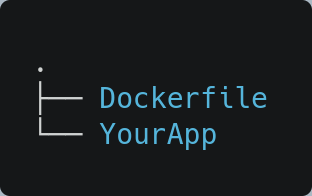

# Docker Tutorial

## Installation

##### LINUX

[Reference](https://docs.docker.com/engine/install/ubuntu/ "Linux Installation Guide")

###### Set up the repository
> Update the apt package index and install packages to allow apt to use a repository over HTTPS:

 ```
 sudo apt-get update
 sudo apt-get install \
    apt-transport-https \
    ca-certificates \
    curl \
    gnupg \
    lsb-release
  ```
    
###### Add Docker’s official GPG key:

```
curl -fsSL https://download.docker.com/linux/ubuntu/gpg | sudo gpg --dearmor -o /usr/share/keyrings/docker-archive-keyring.gpg
```

###### Make sure to update apt

```
sudo apt-get update
```

###### Now Install

```
sudo apt-get install docker-ce docker-ce-cli containerd.io
```

###### Validate Installation

```
sudo docker run hello-world
```

##### Install App Image

[Reference](https://hub.docker.com/search?q=&type=image "App Images")

> Choose your App Environtment <br>
> Example below

```
sudo docker pull golang:1.16.5
```
--------------------

## Setup Docker to your app

> **Rules!!** <br>
> Dockerfile should be inside your app folder


#### Create Dockerfile



##### Inside Dockerfile

```
#declare image app environtment
FROM golang:1.16.5

#container directory setup
WORKDIR /container/directory/workdir/Application

#copy <source> to <container directory>
COPY . /container/directory/workdir/Application

#run the application in the container
CMD [ "./application" ]
```

## Build Docker

```
sudo docker build -t application-name .
```


## Run Docker

```
sudo docker run
```
----------------------

> *Common command below*

#### Check Image

```
sudo docker image ls
```

#### Check Container Running

```
sudo docker ps
```

#### Stop Image Running

```
sudo docker stop @-NAMES
```

#### Remove Image

```
sudo docker image rm -f @-NAMES
```

#### Remove Container

```
sudo docker rm -f @-NAMES
```

#### Auto Restart the container . unless stopped manually

```
docker update --restart unless-stopped neilmedina
```

---------------------

#### Create Volume

```
docker volume create volume_name
```

#### List Volume

```
docker volume ls
```

#### Volume Details

```
docker volume inspect volume_name
```

#### Remove Volume

```
docker volume rm data_volume
```

#### Prune Volume / Remove unused volume / any volume that has no connection to any container is deleted

```
docker volume prune
```

#### Using Volume

```
#docker run -v <source/volume_name:<WORKDIR from Dockerfile> app_image
docker run -v volume_name:/workdir/from/dockerfile app_image
```

#### Using --mount
> The input to -–mount is a string of key-value pairs, separated by commas. Here we've set:
>
> - type – as volume to indicate a volume mount `bind,volume,tmpfs`
> - src – to the name of the volume, though this could have been a source directory if we'd been making a bind mount
> - dst – as the destination mount point in the container
> - volume-driver – the local driver in this case
> - readonly – to make this mount read-only; we could have chosen rw for read/write `ro,rw`
> - bind propagation - replicate the volume to other location `shared,slave,private,rshared,rslave,rprivate`
```
docker run --mount \
  'type=volume,src=data-volume,\
  dst=/var/opt/project,volume-driver=local,\
  readonly'
```

#### Remove Volume

```
docker volume rm data_volume
```


-------------------------

## Docker hub Setup

> Follow in order

###### Setup your credentials

```
sudo docker login
```
###### Prepare the connection of the repository

```
sudo docker build -t dockerid/repository .
```
###### Create a container

```
sudo docker run -d -p 8080:8080 --name yourname  dockerid/repository
```
###### Push to dockerhub

```
sudo docker push dockerid/repository
```
