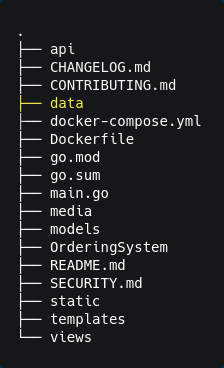

# DOCKER MYSQL AND UADMIN APP SETUP

----------------------

# Reference
#### main tutorial, no need to do it all .. get only what necesary 
https://phoenixnap.com/kb/mysql-docker-container

#### You need to understand to connect your DBConfig to the mysql container
https://github.com/docker-library/mysql/issues/275

#### make sure you use container name for host
https://stackoverflow.com/questions/57566060/panic-dial-tcp-127-0-0-13306-connect-connection-refused

## Docker Setup
### .docker-compose.yml

```yaml
version: "3"  # optional since v1.27.0
services:
  mysql:
    image: mysql/mysql-server:8.0.26
    expose:
      - "3306"
    environment: 
      MYSQL_ROOT_PASSWORD: "NeilGwapo100%" #should match with app Database Config
      MYSQL_ROOT_HOST: "%" #Go to my reference https://github.com/docker-library/mysql/issues/275
    volumes: 
      - MysqlBindVolume:/var/lib/mysql
    restart: always
  web:
    # build: 
    #   context: . #Dockerfile
    #   #dockerfile: Dockerfile.local
    privileged: true
    image: ngmedina14/ordering-system
    environment: 
      - MYSQL_USER=root
      - MYSQL_ROOT_PASSWORD=NeilGwapo100%
      - MYSQL_ROOT_HOST=%
      - MYSQL_DATABASE=ordering-system
    ports:
      - "8080:8080"
    volumes:
      - WebBindVolume:/go/src/github.com/OrderingSystem
    restart: unless-stopped
    depends_on: 
      - mysql
volumes:
  WebBindVolume:
    driver_opts:
        type: none
        device: ${PWD} #/home/neil/go/src/github.com/ngmedina14/OrderingSystem
        o: bind
  MysqlBindVolume:
    driver_opts:
        type: none
        device: ${PWD}/data #/home/neil/go/src/github.com/ngmedina14/OrderingSystem
        o: bind
    

```

### Prerequisite 
## APP Database Config, Setup for the mysql container

```go
package main

import (
	"net/http"

	"github.com/ngmedina14/OrderingSystem/models"
	"github.com/ngmedina14/OrderingSystem/views"
	"github.com/uadmin/uadmin"
)

func main() {
	DBConfig() # Declare
	uadmin.Register(
		models.Item{},
    )
	uadmin.StartServer()
}

// DBConfig !
func DBConfig() {
	// Change DB Setting to MySQL
	uadmin.Database = &uadmin.DBSettings{
		Type:     "mysql",
		Host:     os.Getenv("MYSQL_ROOT_HOST"), # Environtment Value is Located at .docker-compose.yml
		Name:     os.Getenv("MYSQL_DATABASE"),
		User:     os.Getenv("MYSQL_USER"),
		Password: os.Getenv("MYSQL_ROOT_PASSWORD"),
		Port:     3306,
	}
}

```

## Create a folder for mysql Data/ and a place to bind your data so you wont lose the data.. GOT IT?! HAHA



## Create **Named Volume** with _bind type_

im just highlighting the volume part its already in the docker-compose.yml
```yaml
volumes:
  WebBindVolume:
    driver_opts:
        type: none
        device: ${PWD} # your wanted App location or App present working directory
        o: bind
  MysqlBindVolume:
    driver_opts:
        type: none
        device: ${PWD}/data # make sure you have the data folder separated and empty
        o: bind
```
