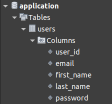

# Reference for Express JS

### Preparation

- Create a proj folder
- Initialize and configure npm `npm init`
- [Install dependencies](#dependencies)
- [Setup a database schema ](#database-schema)


### Dependencies
> Install to project folder directory
> - `npm install nodemon` monitoring script
> - `npm install express --save-dev` Node.js web application framework that provides a robust set of features for web and mobile applications.
> - `npm install mysql2`Fast mysql driver. Implements core protocol, prepared statements, ssl and compression in native JS, made for mysql 8.0 to latest
> - `npm install express-handlebars` Template. The constructor function which holds the internal implementation on its prototype.
> - `npm install dotenv --save` Loads environment variables from .env file.
> - `npm install hbs` Express.js template engine plugin for Handlebars.
> - `npm i bcrypt` Hash and verify passwords 


### File Structure
```
Project-Folder
  ├── controllers  ---------- < handlers for all transactions
  │   └── authAccount.js  --- < transaction for users account and validate inputs
  ├── node_modules  --------- < all dependencies is saved here
  ├── routes  --------------- < API or redirections or display page 
  │   ├── Auth.js  ---------- < redirection of all transaction
  │   └── PageRoutes.js  ---- < navigate pages
  ├── views  ---------------- < HTML template or handlebars 
  │   ├── list.hbs
  │   ├── login.hbs
  │   ├── profile.hbs
  │   └── registration.hbs
  ├── .env  ----------------- < database environtment values
  ├── app.js  --------------- < main file
  ├── package.json  --------- < application configurations
  └── package-lock.json
```
### Database Schema

- Database : `application`
- Table    : `users`
- Fields   : `user_id`, `first_name`, `last_name`, `email`, `password`



###### app.js

```javascript
const express = require('express');
const app = express();// Instantiate Express JS to a variable
const port = 3001


//app.use is a middleware
app.set('view engine','hbs');// render hbs views
app.use(express.urlencoded({extended:true}))
app.use(express.json());// Prerequisite for express JS

// To Routes
app.use('/',require('./routes/PageRoutes'));// Pages
app.use('/auth',require('./routes/Auth'));// All database related api


app.listen(port,()=>{
    console.log("Server Started http://localhost:"+port)
})

```

###### PageRoutes.js

```javascript
const express = require('express');
const router  =  express.Router();

// Route to Login Page
router.get('/',(req,res)=>{
    res.render('login'); // render HTML or HBS file
});

// Route to Registration Page
router.get('/registration',(req,res)=>{
    res.render('registration');
});

module.exports = router
```

###### Auth.js

```javascript
const express = require('express');
const router = express.Router();
const regController = require('../controllers/authAccount');

router.post('/register',regController.register);
router.post('/update_user',regController.updateUser);
router.post('/login',regController.login);
router.get('/edit/:email',regController.profile);
router.get('/delete/:email',regController.delete);

module.exports = router
```

###### authAccount.js

```javascript
const mysql2 = require('mysql2'); // get the client
const dotenv = require('dotenv');
const bcrypt = require('bcrypt');
const async = require('hbs/lib/async');

// setup hidden config for database
dotenv.config({path:'./.env'})

// create the connection to database
const db = mysql2.createConnection({
    host: process.env.DATABASE_HOST,
    user: process.env.DATABASE_USER,
    password: process.env.DATABASE_PASSWORD,
    database: process.env.DATABASE,
    port: process.env.DATABASE_PORT
  });


// Registration export Function
exports.register = ((req,res)=>{
  console.log(req.body)
  // const firstName = req.body.first_name;
  // const lastName = req.body.last_name;
  // const email = req.body.email;
  // const password = req.body.password;
  // const confirmPassword = req.body.password_confirm;

  // destructured
  const {first_name, last_name, email, password, confirm_password} = req.body;
  db.query('select email from users where email = ?',email,
  async (error, row) => {
    if (error) console.log(error);
    if (row.length > 0){
      return res.render('registration',{message:'Email is already use'});
    } else if (password != confirm_password) {
      return res.render('registration',{message:'Password does not match'});
    }
    const hashpassword  = await bcrypt.hash(password,8);
    db.query('insert into users set ?',
        {first_name:first_name,last_name:last_name,email:email,password:hashpassword},
        (err)=> (err)? console.log("ERROR:  db Add:"+err.message) : res.render('registration', {message: 'Successfully registered!'}));
  })
})

exports.profile = (req,res) => {
  const email = req.params.email;
  db.query('select * from users where email = ?',email,
  (error,row)=>{
    (error) ? console.log(error) : res.render('profile',{user:row[0],title:'Edit User'})
  })
}

exports.updateUser = (req,res)=>{
  const {first_name,last_name,email} = req.body;
  db.query('update users set first_name = ?, last_name = ? where email = ?',[first_name,last_name,email],
  (error)=>{ 
    db.query('select * from users',
        (error, row)=>{ (error) ? console.log(error) : res.status(401).render('list',{users:row})})
  })
}

exports.login = (req,res)=>{
  try {
  const {email,password} = req.body;
    if (!email || !password){
      return res.status(400).render('login', {message: 'Fill the required field! MF!'})
    }
    db.query('select * from users where email = ?', email, 
    async(error, row)=>{
      if (error) console.log(error);
      if(!row.length || !(await bcrypt.compare(password, row[0].password))){
        return res.status(401).render('login', {message:'email or password is incorrect'})
      }else{
        db.query('select * from users',
        (error, row)=>{ (error) ? console.log(error) : res.status(401).render('list',{users:row})})
      }
    })
  } catch (error) {
    
  }

}

exports.delete = (req,res) =>{
  const email = req.params.email;
  db.query('delete from users where email = ?',email,
  (error)=>{
    db.query('select * from users',
        (error, row)=>{ (error) ? console.log(error) : res.status(401).render('list',{users:row})})
  })
}
```

###### .env

```
DATABASE = application
DATABASE_HOST = localhost
DATABASE_USER = root
DATABASE_PASSWORD = localpassword
DATABASE_PORT =  3306
```

###### login.hbs

```html
<!DOCTYPE html>
<html lang="en">
<head>
    <meta charset="UTF-8">
    <meta http-equiv="X-UA-Compatible" content="IE=edge">
    <meta name="viewport" content="width=device-width, initial-scale=1.0">
    <title>Login</title>
</head>
<body>
    <form>
        <label for="email">Email</label><br>
        <input name="email" id="email" type="text"><br>
        <label for="password">Password</label><br>
        <input name="password" id="password" type="password"><br>
        <button formmethod="post" formaction="/auth/login" type="submit">Login</button>
    </form>
    {{#if message}}
        <h4>{{message}}</h4>
    {{/if}}
    <p>No Account yet ? signup <a href="/registration">here</a></p>
</body>
</html>
```

###### profile.hbs

```html
<!DOCTYPE html>
<html lang="en">
<head>
    <meta charset="UTF-8">
    <meta http-equiv="X-UA-Compatible" content="IE=edge">
    <meta name="viewport" content="width=device-width, initial-scale=1.0">
    <title>Profile</title>
</head>
<body>
    <form action="/auth/update_user" method="post">
        <h2>{{title}}</h2>
        <label for="first_name">First Name</label><br>
        <input name="first_name" type="text" value="{{user.first_name}}"><br>
        <label for="last_name">Last Name</label><br>
        <input name="last_name" type="text" value="{{user.last_name}}"><br>
        <label for="email">Email</label><br> 
        <input name="email" type="text" value="{{user.email}}"><br>
        <button type="submit" >Update</button><br>
    </form>
</body>
</html>
```

###### list.hbs

```html
<!DOCTYPE html>
<html lang="en">
<head>
    <meta charset="UTF-8">
    <meta http-equiv="X-UA-Compatible" content="IE=edge">
    <meta name="viewport" content="width=device-width, initial-scale=1.0">
    <title>List</title>
</head>
<body>
    <table>
        <tr>
            <th>First Name</th>
            <th>Last Name</th>
            <th>Email</th>
            <th>Action</th>
        </tr>
        {{#each users}}
        <tr>
            <td>{{this.first_name}}</td>
            <td>{{this.last_name}}</td>
            <td>{{this.email}}</td>
            <td><a href="/auth/edit/{{this.email}}">Edit</a><a href="/auth/delete/{{this.email}}">Delete</a></td>
        </tr>
        {{/each}}
    </table>
</body>
</html>
```

###### registration.hbs

```html
<!DOCTYPE html>
<html lang="en">
<head>
    <meta charset="UTF-8">
    <meta http-equiv="X-UA-Compatible" content="IE=edge">
    <meta name="viewport" content="width=device-width, initial-scale=1.0">
    <title>Registration</title>
</head>
<body>
    <form>
        <label for="first_name">First Name</label><br>
        <input name="first_name" type="text"><br>
        <label for="last_name">Last Name</label><br>
        <input name="last_name" type="text"><br>
        <label for="email">Email</label><br> 
        <input name="email" type="text"><br>
        <label for="password">Password</label><br>
        <input name="password" type="password"><br>
        <label for="password">Confirm Password</label><br>
        <input name="confirm_password" type="password"><br>
        <button type="submit" formmethod="post" formaction="/auth/register">Sign Up</button><br>
        <a href="/">login</a>
    </form>
    {{#if message}}
        <h4>{{message}}</h4>
    {{/if}}
</body>
</html>
```


### Run the App
`nodemon app.js`
