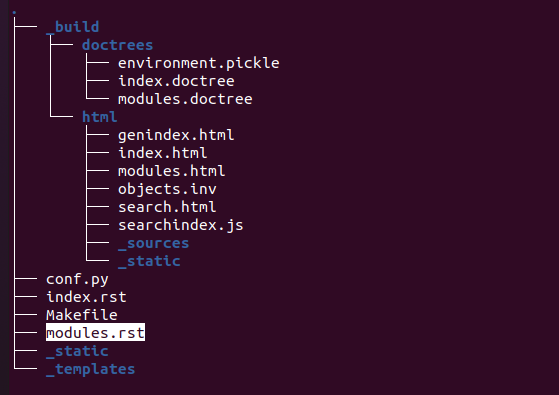

# Readthedocs using Sphinx Tutorial

> Installation 
> Reference : https://www.youtube.com/watch?v=b4iFyrLQQh4

#### Linux Debian/Ubuntu

```
sudo apt-get install python3-sphinx -y
```
### Go to your folder and open a terminal then run this

```
sphinx-quickstart
```
### The setup is here INPUT( just enter , y , n ) *******important*****
```
Welcome to the Sphinx 1.8.5 quickstart utility.

Please enter values for the following settings (just press Enter to
accept a default value, if one is given in brackets).

Selected root path: .

You have two options for placing the build directory for Sphinx output.
Either, you use a directory "_build" within the root path, or you separate
"source" and "build" directories within the root path.
> Separate source and build directories (y/n) [n]: (just enter)

Inside the root directory, two more directories will be created; "_templates"
for custom HTML templates and "_static" for custom stylesheets and other static
files. You can enter another prefix (such as ".") to replace the underscore.
> Name prefix for templates and static dir [_]: (just enter)

The project name will occur in several places in the built documentation.
> Project name: (Name Here)*********************IMPORTANT************************IMPORTANT*************
> Author name(s): (YOUR NAME)**********************IMPORTANT***********************IMPORTANT***********
> Project release []: (just enter)

If the documents are to be written in a language other than English,
you can select a language here by its language code. Sphinx will then
translate text that it generates into that language.

For a list of supported codes, see
http://sphinx-doc.org/config.html#confval-language.
> Project language [en]: (just enter)

The file name suffix for source files. Commonly, this is either ".txt"
or ".rst".  Only files with this suffix are considered documents.
> Source file suffix [.rst]: (just enter)

One document is special in that it is considered the top node of the
"contents tree", that is, it is the root of the hierarchical structure
of the documents. Normally, this is "index", but if your "index"
document is a custom template, you can also set this to another filename.
> Name of your master document (without suffix) [index]: (just enter)
Indicate which of the following Sphinx extensions should be enabled:
> autodoc: automatically insert docstrings from modules (y/n) [n]: y ***** IMPORTANT *********************************IMPORTANT****************************
> doctest: automatically test code snippets in doctest blocks (y/n) [n]: (just enter)
> intersphinx: link between Sphinx documentation of different projects (y/n) [n]: (just enter)
> todo: write "todo" entries that can be shown or hidden on build (y/n) [n]: (just enter)
> coverage: checks for documentation coverage (y/n) [n]: (just enter)
> imgmath: include math, rendered as PNG or SVG images (y/n) [n]: (just enter)
> mathjax: include math, rendered in the browser by MathJax (y/n) [n]: (just enter)
> ifconfig: conditional inclusion of content based on config values (y/n) [n]: (just enter)
> viewcode: include links to the source code of documented Python objects (y/n) [n]: (just enter)
> githubpages: create .nojekyll file to publish the document on GitHub pages (y/n) [n]: (just enter)

A Makefile and a Windows command file can be generated for you so that you
only have to run e.g. `make html' instead of invoking sphinx-build
directly.
> Create Makefile? (y/n) [y]: y ***** IMPORTANT **************************************IMPORTANT***************************************IMPORTANT************
> Create Windows command file? (y/n) [y]: (n)

Creating file ./conf.py.
Creating file ./index.rst.
Creating file ./Makefile.

Finished: An initial directory structure has been created.

You should now populate your master file ./index.rst and create other documentation
source files. Use the Makefile to build the docs, like so:
   make builder
where "builder" is one of the supported builders, e.g. html, latex or linkcheck.

```

### Edit conf.py

> UNCOMMENT THIS LINES<br>
#import os<br>
#import sys<br>
#sys.path.insert(0, os.path.abspath('.'))<br>

then SAVE


```
# -*- coding: utf-8 -*-
#
# Configuration file for the Sphinx documentation builder.
#
# This file does only contain a selection of the most common options. For a
# full list see the documentation:
# http://www.sphinx-doc.org/en/master/config

# -- Path setup --------------------------------------------------------------

# If extensions (or modules to document with autodoc) are in another directory,
# add these directories to sys.path here. If the directory is relative to the
# documentation root, use os.path.abspath to make it absolute, like shown here.
#
#import os***************************UNCOMMENT THIS LINE********************************
#import sys***************************UNCOMMENT THIS LINE********************************
#sys.path.insert(0, os.path.abspath('.'))***************************UNCOMMENT THIS LINE********************************


```

### Edit index.rst 

> ADD THIS LINE
<br>modules

```
.. Ordering System documentation master file, created by
   sphinx-quickstart on Tue Aug  3 12:51:17 2021.
   You can adapt this file completely to your liking, but it should at least
   contain the root `toctree` directive.

Welcome to Ordering System's documentation!
===========================================

.. toctree::
   :maxdepth: 2
   :caption: Contents:

   modules *************************************ADD THIS LINE HERE***************************

Indices and tables
==================

* :ref:`genindex`
* :ref:`modindex`
* :ref:`search`
```

### Run this to your Terminal then go to your folder

```
sphinx-apidoc -o . ..
```
```
OUTPUT:
Creating file ./modules.rst.
```
### Run this to your Terminal then go to your folder

```
make html
```
```
OUTPUT:
Running Sphinx v1.8.5
loading pickled environment... done
building [mo]: targets for 0 po files that are out of date
building [html]: targets for 2 source files that are out of date
updating environment: 0 added, 0 changed, 0 removed
looking for now-outdated files... none found
preparing documents... done
writing output... [100%] modules                                                                                                                                                                             
generating indices... genindex
writing additional pages... search
copying static files... done
copying extra files... done
dumping search index in English (code: en) ... done
dumping object inventory... done
build succeeded.

The HTML pages are in _build/html.
```

### YOU ARE DONE ~ just go and open _build/html/index.html

```
cd _build/html/index.html
```

### NOW CONTINUE EDITING THE module.rst file



> Todo: Add more Info on setting up rst and page

> CHEATSHEET <br>
> https://sphinx-tutorial.readthedocs.io/cheatsheet/#


# OPTIONAL THEME INSTALL

> GO TO THIS SITE AND PICK YOUR DESIRED THEME<br>
https://sphinx-themes.org/#themes

> THIS IS MY PREFERENCE<br>
https://sphinx-themes.org/sample-sites/stanford-theme/

