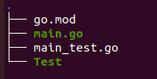

# Unit Test (Basic)

#### Why do we need Unit Testing

> REMEMBER! The Purpose of Unit Testing is to detect the bug whenever we change or add a code in the system.<br>
> Testing Process will greatly improve the coding in the long run <br>
> We developers need to this as habit. For us to be an effective developer <br>
> Trivia if you are good at Unit Test I recommend you try Machine Learning. Some how the process is a bit similar. You'll enjoy it

#### Rules to be followed



- The test file should be located at the same Directory of the target file
- Naming the test file is just copy the name of the target file and add **_test** (Ex. Target file > **main.go** and Test file > **main_test.go**)
- In the test file **every function should have a PREFIX *Test*** (Ex. TestCalculate)
- I Recommend to just add a Prefix Test to the Function you are testing (Ex. If the function you are testing named Calculate then in the test file you'll name it TestCalculate)

#### When How to create a test

We will create a Unit test whenever we have a function test

- First Make sure you have a function to Test

Lets say we will create a function name Calculate() in the main.go

```go
package main

import (
	"fmt"
)

func main() {
	fmt.Println("Golang Testing Tutorial")
	result := Calculate(2)
	fmt.Println(result)
}

// Function that adds 2 to any number given and return the sum.
func Calculate(number int) int {
	val := 2 + number
	return val
}
```

- Second Create a test file

In the test file we will provide some test data 
So whenever we run the test, if the test data has not met the function expectation it will cast a failure in the terminal and means there is a bug.
Don't forget the Prefix *Test* in every Function in the testfile

```go
package main

import "testing"

func TestBasic(t *testing.T) {
	if Calculate(2) != 4 {
		t.Error("Expected 2 + 2 to equal 4")
	}
}

func TestCalculate(t *testing.T) {

	// Declare the parameter and returns of the Function Calculate()
	var tests = []struct {
		input  int // parameter
		expect int // returns
	}{
		// Preset test data {parameter,return}
		{99, 101},
		{2, 5},
		{4, 6},
	}
	// Run the test for Function Calculate
	for _, test := range tests {
		// Checks the function if the return is what we expect, if not it will promt t.Errorf
		if output := Calculate(test.input); output != test.expect {
			// whenever theres an error means the test will result to fail
			t.Errorf("Test Failed: %d inputted, %d expected, %d recieved ", test.input, test.expect, output)
		}
	}
}
```

#### Run test

`go test -v`